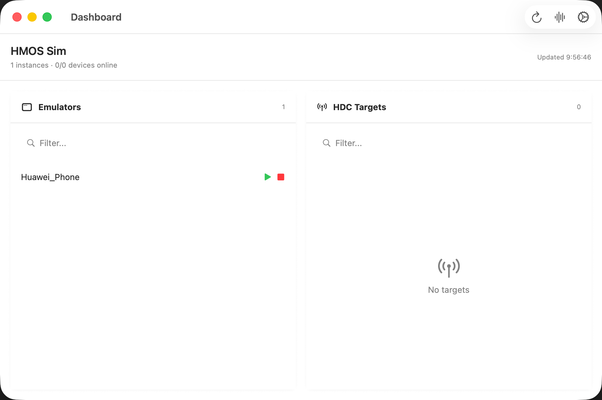

# HMOSSimApp

macOS 菜单栏（状态栏）常驻的小工具：管理 DevEco 的鸿蒙模拟器实例，显示 `hdc` 在线状态，并提供 `hilog` 流式查看窗口。

## 截图

## 需求

- macOS 13+
- 已安装 DevEco Studio（默认路径 `/Applications/DevEco-Studio.app`）

## 运行

- Xcode（推荐）：打开 `HMOSSimApp/HMOSSimApp.xcodeproj` 运行 `HMOSSimApp`

首次运行建议去 Settings 里确认以下路径（默认按 DevEco 安装在 `/Applications` 推断）：

- `Emulator`：`/Applications/DevEco-Studio.app/Contents/tools/emulator/Emulator`
- `hdc`：`/Applications/DevEco-Studio.app/Contents/sdk/default/openharmony/toolchains/hdc`

以及启动模拟器需要的参数：

- `-path`（实例目录）：默认 `~/.Huawei/Emulator/deployed`
- `-imageRoot`（镜像目录）：默认 `~/Library/Huawei/Sdk`

## 用法

- 菜单栏图标 → `Hilog…`：打开日志窗口并自动开始 `hdc hilog`
- 菜单栏图标 → 实例名：`Start/Stop` 启停模拟器
- 菜单栏图标 → `Settings…`：修改 `Emulator/hdc` 路径与启动参数
- 启动后会自动打开 `Dashboard` 窗口（也可在菜单栏点 `Dashboard…` 呼出）

## UI 小提示

- Dashboard 支持实例/targets 过滤与右键菜单（复制/快速动作）
- Logs 支持 “Online only”、复制、清空、过滤与行数显示
